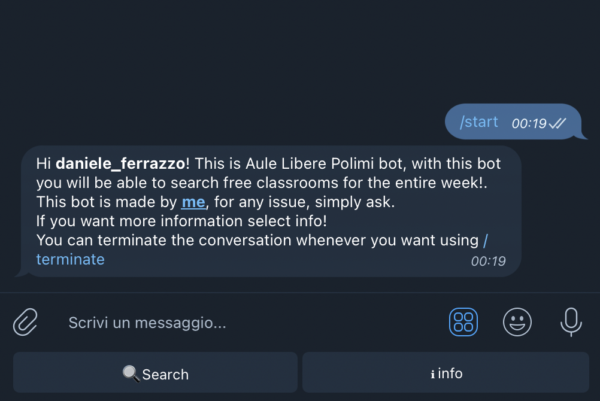
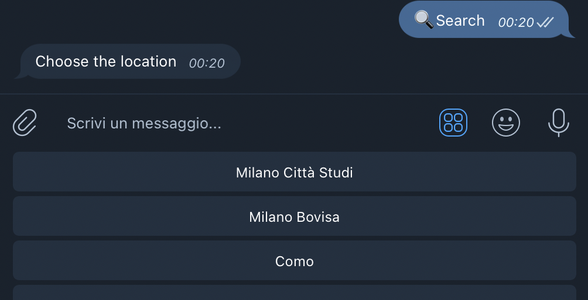
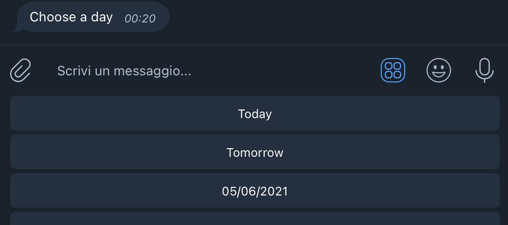

# Aule Libere Polimi
Since the PoliMi site no longer allows people to search for free classrooms this bot was necessary!
Simply search for the classroom status on the chosen day and then find the free classroom using your preferred time slot. You can add it on telegram with this <a href="auleliberepolimi_bot">link</a>


<table>
  <tr>
    <td>Start</td>
     <td>Search</td>
     <td>Day</td>
  </tr>
  <tr>
    <td></td>
    <td></td>
    <td></td>
  </tr>
 </table>

 # Set Up Your Personal Bot

## Dependencies
 If you have pipenv installed you could simply run the command:
 ```pipenv install``` and then ``` pipenv shell ``` to enter in the enviroment,
 otherwise you will have to install manually all the packages:
 ```
 beautifulsoup4
requests
python-telegram-bot
python-dotenv
 ```
 with the command :
 ``` pip install <package> ``` 
## Config
Now you simply have to create a ``` .env ``` file and insert the token of your telegram bot saved as:
```
TOKEN=YOURTOKEN
```

 # Disclaimer
This bot will work as long as the PoliMi website keeps the same layout

